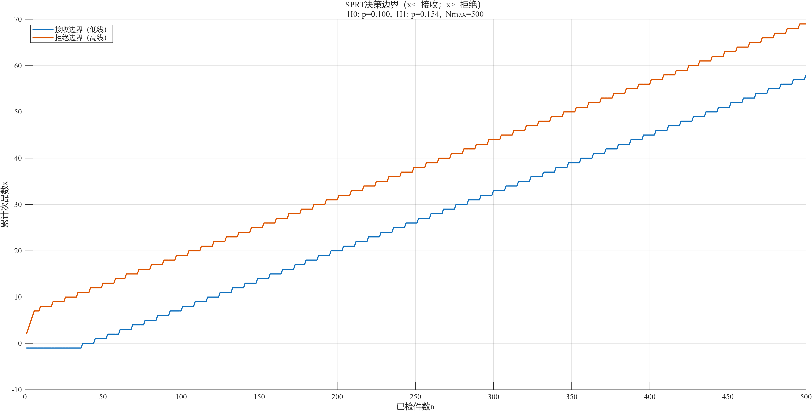
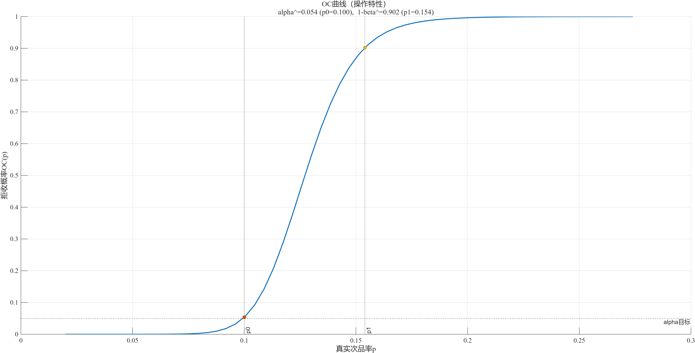
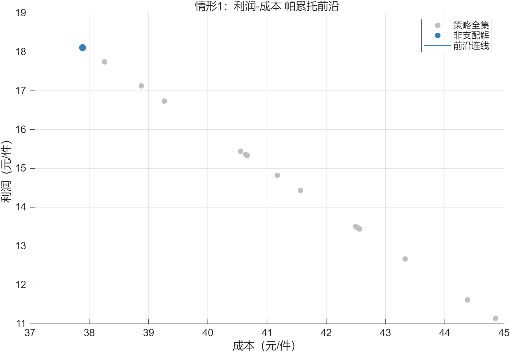

# 生产质检与返工决策优化 / Production Quality-Control Optimization

<p align="center"><strong>贯通抽样检验、装配决策、拆解返工、利润分析与稳健性评估的多阶段质量控制模型。</strong><br>A multi-stage quality-control framework connecting sampling inspection, assembly decisions, disassembly/rework, profit analysis, and robustness checks.</p>

<p align="center">  </p>

<p align="center"><a href="#中文说明">中文</a> · <a href="#english">English</a> · <a href="#结果展示--results">结果展示 / Results</a> · <a href="#复现--reproduction">复现 / Reproduction</a></p>

## 中文说明

### 项目定位

贯通抽样检验、装配决策、拆解返工、利润分析与稳健性评估的多阶段质量控制模型。 本仓库强调“问题—方法—代码—结果”的对应关系，适合作为课程作业、算法练习或建模研究的可复现档案。

### 核心方法

- 序贯抽样与 OC/ASN 曲线 / sequential sampling with OC and ASN curves
- 离散策略枚举与利润建模 / discrete policy enumeration and profit modeling
- 帕累托、灵敏度与稳健分析 / Pareto, sensitivity, and robust analysis

## English

### Positioning

A multi-stage quality-control framework connecting sampling inspection, assembly decisions, disassembly/rework, profit analysis, and robustness checks. The repository keeps the problem statement, implementation, and outputs close together so the work can be inspected and reproduced.

### What is demonstrated

- 序贯抽样与 OC/ASN 曲线 / sequential sampling with OC and ASN curves
- 离散策略枚举与利润建模 / discrete policy enumeration and profit modeling
- 帕累托、灵敏度与稳健分析 / Pareto, sensitivity, and robust analysis

## 问题拆解 / Problem Breakdown

| 阶段 / Stage | 中文说明 | English description |
| --- | --- | --- |
| 输入 / Input | 整理 `缺陷与成本 / Inputs` 及模型所需参数，检查单位、范围和文件位置。 | Prepare the 缺陷与成本 / Inputs and validate units, ranges, and file locations. |
| 处理 / Process | 通过 `检验策略 / Inspect` 将原始问题转换为可计算表示。 | Convert the original problem into a computable representation through 检验策略 / Inspect. |
| 求解 / Solve | 执行 `装配/返工 / Decide`，保留中间结果以便检查。 | Execute 装配/返工 / Decide and retain intermediate artifacts for inspection. |
| 输出 / Output | 生成 `利润与风险 / Evaluate`，并结合约束解释结果。 | Produce 利润与风险 / Evaluate and interpret it together with the constraints. |

## 方法设计 / Method Design

| # | 方法与作用 / Method and role |
| ---: | --- |
| 1 | 序贯抽样与 OC/ASN 曲线 / sequential sampling with OC and ASN curves |
| 2 | 离散策略枚举与利润建模 / discrete policy enumeration and profit modeling |
| 3 | 帕累托、灵敏度与稳健分析 / Pareto, sensitivity, and robust analysis |

这些模块彼此独立但按数据流连接：输入准备负责可计算性，核心算法负责求解，结果层负责把数字转换为可审查的图、表或状态序列。

These modules are separated but connected by the data flow: input preparation ensures computability, the core algorithm solves the model, and the output layer turns numbers into inspectable figures, tables, or state sequences.

## 工作流 / Workflow


## 结果展示 / Results

| <br><sub>抽样决策边界 / Sampling decision boundary</sub> | <br><sub>OC 曲线 / OC curve</sub> | <br><sub>利润—成本帕累托 / Profit–cost Pareto front</sub> |
| --- | --- | --- |


**验证摘要 / Verification summary**

已包含 67 张真实结果图，覆盖决策边界、OC/ASN、利润排序、帕累托前沿和灵敏度。 / Includes 67 result figures covering decision boundaries, OC/ASN, profit ranking, Pareto fronts, and sensitivity.

> 图表来自仓库现有输出或本地实际运行生成；README 不使用虚构指标。
> Figures are existing project outputs or were generated by an actual local run; no performance metric is fabricated.

### 如何阅读结果 / How to Read the Results

- 先核对标题、坐标轴、单位和情景标签，再比较曲线、最优值或状态变化。
- Check titles, axes, units, and scenario labels before comparing curves, optima, or state transitions.
- 图像用于回答“模型产生了什么”，脚本和数据用于回答“结果如何得到”。
- Figures answer *what the model produced*; scripts and data answer *how it was produced*.
- 不同脚本的参数可能服务于不同子问题，跨图比较前应先确认参数口径一致。
- Parameters may belong to different subtasks; confirm a shared definition before comparing figures.

## 项目结构 / Project Map

| 路径 / Path | 作用 / Purpose |
| --- | --- |
| `q1/` | 抽样检验 / sampling inspection |
| `q2/` | 双零件—单成品 / two-part assembly |
| `q3/` | 多阶段装配返工 / multi-stage rework |
| `q4/` | 风险与稳健优化 / risk and robustness |

## 复现 / Reproduction

### 环境 / Environment

- MATLAB 项目建议使用 MATLAB R2025a 或兼容版本；含 `regress`、`linprog` 等函数的脚本可能需要 Statistics and Machine Learning Toolbox 或 Optimization Toolbox。
- For MATLAB projects, MATLAB R2025a or a compatible release is recommended. Scripts using functions such as `regress` or `linprog` may require the relevant toolbox.
- 非 MATLAB 项目的额外条件见下面的运行命令与项目文件。
- For non-MATLAB projects, see the command and project files below for additional requirements.

### 快速开始 / Quick Start

```text
% Run each q1–q4 main script from its own folder; outputs are written beside the model.
```

1. 克隆仓库并保持现有目录结构。 / Clone the repository and preserve its directory structure.
2. 从仓库根目录或脚本所在目录运行上面的入口。 / Run the entry point from the repository root or the script's own directory.
3. 若脚本依赖数据文件，请勿移动配套的 CSV、XLSX、MAT 或资源目录。 / Keep companion CSV, XLSX, MAT, and asset files in place.

### 复现检查清单 / Reproduction Checklist

| 检查项 / Check | 预期 / Expected |
| --- | --- |
| 工作目录 / Working directory | 当前目录能找到入口脚本及其相对路径依赖。 / Entry scripts and relative dependencies resolve correctly. |
| 依赖 / Dependencies | 所需工具箱、运行时或框架已安装。 / Required toolboxes, runtimes, or frameworks are installed. |
| 数据 / Data | 文件名、工作表、列顺序和单位未被意外修改。 / Filenames, sheets, column order, and units remain unchanged. |
| 随机性 / Randomness | 随机项目在对比实验时固定随机种子。 / Randomized projects use a fixed seed for comparisons. |
| 输出 / Outputs | 控制台无未处理异常，图表或结果文件成功生成。 / No unhandled error appears and expected artifacts are generated. |

## 验证状态 / Validation Status

| 层级 / Layer | 状态 / Status | 说明 / Notes |
| --- | --- | --- |
| 仓库结构 / Repository structure | ✅ 已检查 / Checked | 入口、核心源码和配套资源已盘点。 / Entry points, source, and companion assets were inventoried. |
| README 链接 / README links | ✅ 已检查 / Checked | 本地图片引用已做存在性校验。 / Local image references were checked for existence. |
| 结果真实性 / Result provenance | ✅ 已检查 / Checked | 仅引用已有输出或实际执行生成的结果。 / Only existing or locally reproduced outputs are shown. |
| 全环境复现 / Full environment | 见上方摘要 / See summary | 交互、数据库、Unity 或特定工具箱项目可能需要额外环境。 / Interactive, database, Unity, or toolbox-dependent projects may need extra setup. |

## 可扩展方向 / Roadmap Ideas

- 将固定参数集中到配置文件，并为单位、范围和缺失值增加输入校验。
- Move fixed parameters into configuration files and validate units, ranges, and missing values.
- 为核心函数增加最小测试用例，覆盖正常、边界和不可行情形。
- Add small tests for normal, boundary, and infeasible cases.
- 将关键数值结果同步导出为 CSV/JSON，并自动生成对比图和实验摘要。
- Export key numeric results to CSV/JSON and generate comparison figures and experiment summaries automatically.
- 对随机或优化算法记录随机种子、求解器版本、停止条件和运行时间。
- Record seeds, solver versions, stopping criteria, and runtime for randomized or optimization routines.

## 已知限制 / Known Limits

- 这是学习与研究型项目，参数、数据范围和结论应结合原始场景解释，不宜直接用于生产决策。
  This is an educational/research project; interpret parameters and conclusions within the original scenario before any real-world use.
- 部分早期脚本采用交互式输入或固定相对路径；若批处理运行，请先检查入口文件。
  Some early scripts use interactive input or fixed relative paths; inspect the entry point before automating it.

## 常见问题 / FAQ

**为什么运行后没有图？ / Why is no figure displayed?**

部分入口只输出数值或状态序列；也可能是脚本尚未运行到绘图阶段。先检查控制台，再查看结果目录。
Some entries produce only numeric or state output. Check the console first, then inspect the result directory.

**为什么结果和 README 略有不同？ / Why do my results differ slightly?**

求解器版本、随机种子、浮点误差、数据版本或交互输入都可能造成差异。请先按复现清单核对环境。
Solver versions, random seeds, floating-point behavior, data revisions, or interactive inputs can all cause differences.

## 贡献 / Contributing

欢迎通过 Issue 提交复现问题、改进建议或新的对照实验。
Issues describing reproduction problems, improvements, or additional comparison experiments are welcome.

---

如果这个项目对你有帮助，欢迎 Star。 / If this project is useful, consider giving it a star.
